# 10-Task Milestone Plan

This file is the working plan for the first 10 Meridian Trust Bank tasks.

The local workflow is now SQLite-only.

---

## 1. Outcome

The milestone ships one coherent 10-task bank slice with:

1. a local SQLite validation database
2. CSV exports for table-by-table review
3. JSON schema files for structure handoff
4. task specs with gold SQL and gold answers
5. Genie or baseline-agent smoke logs at 3 runs per task

Target task mix:

1. 3 easy
2. 5 medium
3. 2 hard

Working bank story:

1. Finance
2. HR
3. Communication
4. Marketing
5. Operations

Everything stays inside one fictional regional bank: `Meridian Trust Bank`.

---

## 2. Canonical artifacts

| Artifact | Path | Why it matters |
|---|---|---|
| Local validation database | `verification/runs/tier_c_seed.sqlite` | Main local source of truth for task authoring and answer locking |
| CSV export | `verification/exports/tier_c_csv/` | Easy table review without opening the database |
| JSON schemas | `verification/schema/tier_c_json/` | Portable schema handoff for the team |
| Table manifest | `generation_manifest` table inside SQLite | Maps canonical names to physical SQLite tables |
| Local query helper | `tools/sqlite_query.py` | Lets local SQL keep canonical names like `main.finance_core.fee_revenue` |
| Bank canon | `docs/bank_canon.md` | Locked business identity and naming |
| Schema map | `docs/milestone_schema_map.md` | Minimum coherent schema and join backbone |
| Gold table map | `docs/milestone_gold_table_map.md` | Gold tables, task paths, and seed order |

---

## 3. Current state

Phase status:

1. Phase 0 -> complete
2. Phase 1 -> complete
3. Phase 2 -> complete
4. Phase 3 -> current focus
5. Phase 4 -> smoke and iteration after task drafting

What is already done:

1. the bank story is locked
2. the milestone schema is defined
3. Tier A, Tier B, and Tier C tables are generated
4. the local artifact is SQLite-only
5. CSV and JSON schema exports are available

What remains:

1. finish the 10 task files
2. run smoke validation at 3 attempts per task
3. tighten prompts, assets, and verifiers where needed
4. prepare the final delivery bundle

---

## 4. Working workflow

```mermaid
flowchart LR
    A[Bank Canon Locked] --> B[Schema Map and Gold Table Map]
    B --> C[Generate Tier C SQLite Slice]
    C --> D[Export CSV and JSON Schema]
    D --> E[Run Local SQL Through sqlite_query.py]
    E --> F[Capture Gold SQL and Gold Answer]
    F --> G[Write Task YAML Files]
    G --> H[Run Genie or Baseline Agent 3x]
    H --> I[Fix Prompt, SQL, Assets, Verifier]
    I --> J[Ship 10-Task Bundle]
```



Plain-English order:

1. keep the bank canon fixed
2. rebuild the Tier C slice when data changes
3. use SQLite as the local truth source
4. use `tools/sqlite_query.py` for local SQL with canonical names
5. capture the gold SQL and exact answer before locking a task
6. keep anchors and distractors manual for this milestone
7. use Genie only after the repo task file exists

---

## 5. Working commands

### Fresh full rebuild

```bash
cd /Users/apple/Documents/turing/apple/databrick-rl
.venv/bin/python -m workspace.generators.run \
  --target sqlite \
  --build tier-c \
  --out verification/runs/tier_c_seed.sqlite \
  --csv-dir verification/exports/tier_c_csv \
  --schema-json-dir verification/schema/tier_c_json
```

### Larger local build

```bash
cd /Users/apple/Documents/turing/apple/databrick-rl
.venv/bin/python -m workspace.generators.run \
  --target sqlite \
  --build tier-c \
  --out verification/runs/tier_c_seed.sqlite \
  --scale 2.0
```

### Preferred local query path

```bash
cd /Users/apple/Documents/turing/apple/databrick-rl
.venv/bin/python tools/sqlite_query.py --list-mapping
.venv/bin/python tools/sqlite_query.py --sql "select branch_id, sum(fee_amount_usd) as total_fee from main.finance_core.fee_revenue group by 1 order by 2 desc limit 5"
```

Notes:

1. write local SQL with canonical names such as `main.finance_core.fee_revenue`
2. the helper rewrites those names to SQLite tables such as `finance_core__fee_revenue`
3. this avoids memorizing the flattened local names during task authoring

---

## 6. Phase-by-phase execution plan

| Phase | Goal | Main output | Gate |
|---|---|---|---|
| 0 | lock the bank story and IDs | `docs/bank_canon.md` | story and ID rules do not move |
| 1 | lock the schema and joins | `docs/milestone_schema_map.md` and `docs/milestone_gold_table_map.md` | every planned task has a clean gold path |
| 2 | generate the milestone slice | `tier_c_seed.sqlite`, CSVs, JSON schemas | local SQL works for all gold paths |
| 3 | author 10 tasks | task YAML files with gold SQL and answers | all 10 tasks draft cleanly |
| 4 | run smoke checks | 3-run Genie or baseline-agent log | flaky tasks are triaged, not ignored |
| 5 | iterate and ship | final task bundle and support docs | delivery checklist is all green |

---

## 7. Simplified ERD for the 10-task slice

This ERD shows the join backbone that matters most for the milestone.

```mermaid
erDiagram
    CALENDAR_PERIODS {
        string period_id PK
        date start_date
        date end_date
    }

    BRANCHES {
        string branch_id PK
        string branch_name
        string region_name
    }

    PRODUCTS {
        string product_id PK
        string product_family
        string product_name
    }

    CHANNELS {
        string channel_id PK
        string channel_name
        string channel_type
    }

    EMPLOYEES {
        string employee_id PK
        string branch_id FK
        string department
    }

    CUSTOMERS {
        string customer_id PK
        string branch_id FK
        string product_id FK
    }

    ACCOUNTS {
        string account_id PK
        string customer_id FK
        string branch_id FK
        string product_id FK
    }

    FEE_REVENUE {
        string branch_id FK
        string product_id FK
        string period_id FK
        decimal fee_amount_usd
    }

    PAYROLL_RUNS {
        string employee_id FK
        string branch_id FK
        string period_id FK
        decimal total_pay_usd
    }

    CAMPAIGNS {
        string campaign_id PK
        string product_id FK
        string period_id FK
        string owner_employee_id FK
    }

    LEAD_CONVERSIONS {
        string campaign_id FK
        string customer_id FK
        string account_id FK
        string period_id FK
    }

    BRANCH_INCIDENTS {
        string incident_id PK
        string branch_id FK
        string period_id FK
        string channel_id FK
    }

    INCIDENT_THREADS {
        string incident_id FK
        string branch_id FK
        string period_id FK
        string channel_id FK
    }

    CHANNEL_MESSAGES {
        string channel_id FK
        string employee_id FK
        string period_id FK
    }

    SERVICE_SLA_EVENTS {
        string incident_id FK
        string branch_id FK
        string period_id FK
    }

    CAMPAIGN_ANNOUNCEMENTS {
        string campaign_id FK
        string channel_id FK
        string period_id FK
        string owner_employee_id FK
    }

    EMPLOYEE_CHANGES {
        string employee_id FK
        string branch_id FK
        string period_id FK
        string change_type
    }

    DEPOSIT_BALANCES {
        string account_id FK
        string customer_id FK
        string branch_id FK
        string period_id FK
    }

    GL_ENTRIES {
        string account_id FK
        string branch_id FK
        string period_id FK
        decimal amount_usd
    }

    BRANCHES ||--o{ EMPLOYEES : staffs
    BRANCHES ||--o{ CUSTOMERS : serves
    BRANCHES ||--o{ ACCOUNTS : books
    PRODUCTS ||--o{ CUSTOMERS : segments
    PRODUCTS ||--o{ ACCOUNTS : classifies
    CUSTOMERS ||--o{ ACCOUNTS : owns
    BRANCHES ||--o{ FEE_REVENUE : measures
    PRODUCTS ||--o{ FEE_REVENUE : splits
    CALENDAR_PERIODS ||--o{ FEE_REVENUE : closes
    EMPLOYEES ||--o{ PAYROLL_RUNS : paid_in
    BRANCHES ||--o{ PAYROLL_RUNS : assigned_to
    CALENDAR_PERIODS ||--o{ PAYROLL_RUNS : paid_for
    PRODUCTS ||--o{ CAMPAIGNS : promotes
    EMPLOYEES ||--o{ CAMPAIGNS : owns
    CALENDAR_PERIODS ||--o{ CAMPAIGNS : scheduled_in
    CAMPAIGNS ||--o{ LEAD_CONVERSIONS : drives
    CUSTOMERS ||--o{ LEAD_CONVERSIONS : converts
    ACCOUNTS ||--o{ LEAD_CONVERSIONS : opens
    BRANCHES ||--o{ BRANCH_INCIDENTS : experiences
    CALENDAR_PERIODS ||--o{ BRANCH_INCIDENTS : occurs_in
    CHANNELS ||--o{ BRANCH_INCIDENTS : reported_in
    BRANCH_INCIDENTS ||--o{ INCIDENT_THREADS : discussed_as
    CHANNELS ||--o{ INCIDENT_THREADS : hosted_in
    BRANCH_INCIDENTS ||--o{ SERVICE_SLA_EVENTS : tracked_by
    CHANNELS ||--o{ CHANNEL_MESSAGES : contains
    EMPLOYEES ||--o{ CHANNEL_MESSAGES : posts
    CAMPAIGNS ||--o{ CAMPAIGN_ANNOUNCEMENTS : announced_by
    CHANNELS ||--o{ CAMPAIGN_ANNOUNCEMENTS : published_to
    EMPLOYEES ||--o{ EMPLOYEE_CHANGES : changes
    BRANCHES ||--o{ EMPLOYEE_CHANGES : happens_at
    ACCOUNTS ||--o{ DEPOSIT_BALANCES : measured_in
    CALENDAR_PERIODS ||--o{ DEPOSIT_BALANCES : reported_in
    ACCOUNTS ||--o{ GL_ENTRIES : impacts
    BRANCHES ||--o{ GL_ENTRIES : books
    CALENDAR_PERIODS ||--o{ GL_ENTRIES : posted_in
```



---

## 8. Task build order

| Task | Difficulty | Primary gold path | Checkpoint |
|---|---|---|---|
| `T-001` | easy | `main.finance_core.fee_revenue -> branches -> calendar_periods` | easy-task ready |
| `T-002` | easy | `main.hr_people.employee_directory -> branches` | easy-task ready |
| `T-003` | easy | `main.marketing_campaigns.campaigns -> products -> calendar_periods` | easy-task ready |
| `T-004` | medium | `payroll_runs + fee_revenue + branches + periods` | medium-task ready |
| `T-005` | medium | `campaigns + lead_conversions + accounts` | medium-task ready |
| `T-006` | medium | `incident_threads + branch_incidents + branches + periods` | medium-task ready |
| `T-007` | medium | `channel_messages + employee_directory` | medium-task ready |
| `T-008` | medium | `service_sla_events + deposit_balances` | medium-task ready |
| `T-009` | hard | `campaigns + campaign_announcements + lead_conversions` | hard-task ready |
| `T-010` | hard | `employee_changes + branch_incidents + gl_entries` | hard-task ready |

Authoring order:

1. `T-001` to `T-003`
2. `T-004` to `T-008`
3. `T-009` and `T-010`

---

## 9. QA gates for each task

Before a task is considered stable:

1. the question reads like Meridian Trust Bank, not a generic company
2. the gold SQL runs locally against `tier_c_seed.sqlite`
3. the gold answer is captured exactly from the query result
4. the expected assets list only includes the real gold path
5. anchors and distractors stay manual and do not claim `verified: true`
6. the verifier matches the output shape
7. the task survives the 3-run smoke pass or is explicitly triaged

---

## 10. Delivery checklist

- [ ] `tier_c_seed.sqlite` rebuilt and current
- [ ] CSV export refreshed if tables changed
- [ ] JSON schema export refreshed if tables changed
- [ ] 10 task files present
- [ ] gold SQL and gold answers captured for all 10
- [ ] manual claim log updated for any anchor or distractor changes
- [ ] Genie or baseline-agent smoke log captured at 3 runs per task
- [ ] final bundle ready for review and handoff

---

## 11. Operating rules for this milestone

1. local validation uses SQLite only
2. canonical local SQL should go through `tools/sqlite_query.py`
3. `users_pool.json` stays a sanitized seed source only
4. cross-task reuse is allowed if it is believable and documented
5. manual anchors and distractors are acceptable for this milestone, but they must be honest
6. Genie is a validation step, not the first authoring step

---

## 12. Short working summary

Build the truth first, query it through SQLite, lock the gold SQL and gold answer, write the task file, run the 3-pass smoke check, then iterate only where the evidence says the task is weak.
